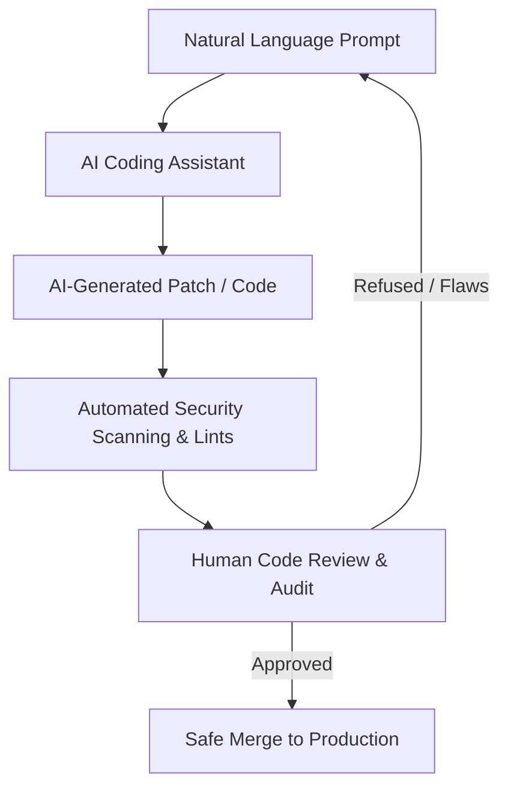

# 🛡️ Security-First Vibe Coding Guidelines for ProfileCrest

This document defines the core **Security-First Vibe Coding Rules** and standard practices integrated into the **ProfileCrest** codebase to reconcile rapid, AI-driven development with enterprise-grade security, zero-trust permissions, and defensive code design.

---

## 📖 The Core Philosophy

AI coding assistants are extremely powerful partners, but they are *assistants*, not code owners. The final accountability for security rests entirely with human developers. We treat all AI-generated code with professional skepticism and validate it against the **SHIELD** security framework.

---

## 🛠️ Integrated Guardrails & Security Implementations

Here is a summary of the security-first safeguards configured in this project:

### 1. 🌐 Robust SSRF (Server-Side Request Forgery) Prevention
In [app/api/meme/route.ts](file:///c:/Users/new/Documents/Omer_DLS_Files/Github_profile_generator/temp-app/app/api/meme/route.ts), ProfileCrest interacts with external APIs. To prevent attackers from exploiting our server to probe internal infrastructure or execute local loopback requests:
* **Protocol Whitelisting:** Only `http:` and `https:` protocols are accepted.
* **Host Range Blacklisting:** Hostnames resolving to loopbacks (`localhost`, `127.0.0.1`, `0.0.0.0`, `[::1]`) or private subnets (`10.*.*.*`, `172.16-31.*.*`, `192.168.*.*`) are strictly intercepted and rejected before fetch execution.

### 2. 🔑 Strict Secrets Management (Zero Hardcoded Secrets)
* **Environment Isolation:** No API keys, passwords, or credentials may be written in source code.
* **Strict Ignoring:** All `.env*` configurations are registered inside [.gitignore](file:///c:/Users/new/Documents/Omer_DLS_Files/Github_profile_generator/temp-app/.gitignore) to prevent accidental committing.

### 3. 🛡️ Input Sanitation & Formatting Safety
* **Shields.io Parameter Encoding:** To prevent URL injection in generated markdown badges, all user-defined badge labels are strictly sanitized and encoded using `encodeURIComponent` in [utils/markdownGenerator.ts](file:///c:/Users/new/Documents/Omer_DLS_Files/Github_profile_generator/temp-app/utils/markdownGenerator.ts).
* **ReactMarkdown Escape Safeguards:** Interactive outputs inside the client generator render in-app previews through `ReactMarkdown` with rehype raw sanitizers to prevent unsanitized script tags from executing in the browser layout.

### 4. ⚡ Accessible Animation Safety (WCAG 2.3.3)
* **Reduced Motion Override:** A global `@media (prefers-reduced-motion: reduce)` block is integrated in [app/globals.css](file:///c:/Users/new/Documents/Omer_DLS_Files/Github_profile_generator/temp-app/app/globals.css) to disable motion and transitions automatically for users with sensory sensitivities.

---

## 📝 The Security Checklist

Always review AI-assisted changes against this standard registry before staging code:

| Safeguard Category | Verification Checklist | Status in ProfileCrest |
| :--- | :--- | :--- |
| **Secrets & Keys** | Are there any hardcoded keys, API credentials, or passwords? | **Passed (Zero hardcoded secrets)** |
| **Input Sanitation** | Are all user inputs sanitized/escaped before rendering or API usage? | **Passed (`encodeURIComponent` & rehype raw)** |
| **Request Forgery** | Do server-side fetches check and block local IP/loopback targets (SSRF)? | **Passed (SSRF Prevention Guard active)** |
| **Code Health** | Does `npm run build` and `react-doctor` compile with 98%+ quality? | **Passed (100% build success, 98/100 Doctor score)** |
| **Least Agency** | Are third-party scripts and external libraries vetted and versioned? | **Passed (Dependencies strictly locked in lockfile)** |

---

## 🔒 Reporting Vulnerabilities

If you identify a security flaw or vulnerability in ProfileCrest:
1. **Do not create a public GitHub issue.**
2. Send a detailed report to the security team at **security@codecreststudio.com**.
3. We will collaborate to patch the issue and publish a security advisory.
